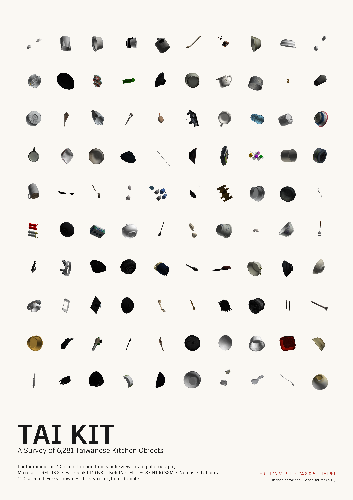

# TAI KIT

**100 AI-reconstructed everyday kitchen objects · v0.1 beta · MIT**



---

## About the name

**TAI** = *Taiwanese-style* (台式) · **KIT** = *kit of objects / kitchen*.
The double reading was too fun to drop: a kit of objects from the Taiwanese
kitchen.

---

## What's in v0.1

100 selected 3D models of everyday Taiwanese-style kitchen objects —
reconstructed from single-view photography using an AI image-to-3D pipeline.
Models are organized into **24 functional categories** (bowl, cup, plate,
spoon, cookware, ladle, funnel, and more). Each item ships with a PBR-textured
glTF binary, a reference render, and bilingual metadata (English +
Traditional Chinese).

This is a **small-scale beta release** to gather feedback before a fuller
collection. Expect rough edges.

### Stats

| | |
|---|---|
| Items | 100 |
| Categories | 24 |
| Format | glTF 2.0 binary (`.glb`) with embedded PBR textures |
| Total size | ~810 MB |
| Languages | English, Traditional Chinese |
| License | MIT |

---

## Repository layout

```
tai-kit/
├── README.md              ← you are here
├── LICENSE                ← MIT
├── CITATION.cff
├── CHANGELOG.md
├── NOTICE.md              ← takedown process
├── docs/
│   ├── DISCLAIMER.md
│   ├── METHODOLOGY.md     ← how the models were generated
│   └── USAGE.md           ← loading in three.js / Blender / Unity / Python
└── assets/v0.1/
    ├── models/
    │   ├── bowl/tk_0002.glb
    │   ├── cup/tk_0007.glb
    │   └── ... (organized by category)
    ├── previews/          ← reference renders
    ├── metadata.json      ← all item metadata, flat array
    └── tai-kit-v0.1-poster.png
```

---

## Quick start

```bash
git clone https://github.com/<your-username>/tai-kit.git
cd tai-kit

# Python example
python3 - <<'PY'
import trimesh, json
meta = json.load(open('assets/v0.1/metadata.json'))
m = trimesh.load(f"assets/v0.1/models/bowl/{meta[1]['id']}.glb", force='mesh')
print(meta[1]['name_en'], '—', m.vertices.shape[0], 'verts,', m.faces.shape[0], 'faces')
PY
```

See [`docs/USAGE.md`](docs/USAGE.md) for three.js, Blender, and Unity
examples, plus `jq` queries for filtering by category, material, or
face count.

---

## Metadata schema

Each entry in `metadata.json`:

```json
{
  "id": "tk_0002",
  "name_en": "Ceramic Bowl",
  "name_zh": "陶瓷碗",
  "category": "bowl",
  "tags": ["bowl", "ceramic"],
  "format": "glb",
  "version": "0.1.0",
  "extent_m": [0.245, 0.182, 0.245],
  "face_count": 18234,
  "dimensions_cm": [14.5, 7.0]
}
```

- `category` — one of 24 functional categories (see [`docs/USAGE.md`](docs/USAGE.md))
- `tags` — free-form, always includes `category` and `material` when detected
- `extent_m` — axis-aligned bounding box in meters (reconstruction frame, normalized)
- `face_count` — triangle count in the mesh
- `dimensions_cm` — best-effort real-world dimensions from the source catalog, in cm
  (2–3 values, typically `[diameter, height]` or `[width, depth, height]`; present for ~92% of items)

---

## Generation pipeline

Each model was reconstructed from a single source photograph through a
neural image-to-3D pipeline:

- **Microsoft [TRELLIS.2](https://github.com/microsoft/TRELLIS.2)** — image-to-3D generation
- **Meta [DINOv3](https://github.com/facebookresearch/dinov3)** — image feature extraction
- **[BiRefNet](https://github.com/ZhengPeng7/BiRefNet)** (MIT variant) — subject isolation

Reconstruction of the parent dataset ran on 8× NVIDIA H100 SXM GPUs.
See [`docs/METHODOLOGY.md`](docs/METHODOLOGY.md) for details, tradeoffs,
and known artifacts.

---

## License

Everything in this repository is released under the [**MIT License**](LICENSE)
— code, scripts, metadata, preview renders, and 3D mesh files.

Please also read [`docs/DISCLAIMER.md`](docs/DISCLAIMER.md) before commercial
use: TAI KIT items are generic utilitarian objects depicted as AI
reconstructions; we make no claims over underlying physical designs and
users are responsible for their own legal diligence.

If you spot an item that concerns you on IP or privacy grounds, see
[`NOTICE.md`](NOTICE.md) for the takedown process.

---

## Citation

```bibtex
@misc{tai_kit_v0_1,
  title  = {TAI KIT: AI-Reconstructed Taiwanese Kitchen Objects, v0.1},
  author = {TAI KIT contributors},
  year   = {2026},
  note   = {Version 0.1.0 beta. MIT licensed.}
}
```

See [`CITATION.cff`](CITATION.cff) for the machine-readable form.

---

## Roadmap

- **v0.1** (this release) — 100 items, 24 categories, single-view reconstruction
- **v1.0** — larger selection, higher-resolution source images, per-item
  manual QC pass, optional physics-ready variants

Feedback welcome via GitHub issues.

---

# TAI KIT（繁體中文）

**100 件 AI 重建的日常廚房物件 · v0.1 beta · MIT 授權**

> **TAI** 取「台式」之意，**KIT** 兼指 *kitchen*（廚房）與 *kit*（工具組）。
> 一組來自台灣廚房的物件工具包。

100 件精選的 3D 模型，涵蓋碗、杯、盤、湯匙、鍋具、杓、漏斗等 24 個功能類別。
每件皆提供 glTF 2.0 二進位格式（含 PBR 貼圖）、參考渲染圖，以及中英文雙語
metadata。

此為**小規模 beta 測試釋出**，用於收集回饋後擴充完整版本。

## 使用

載入方式請參考 [`docs/USAGE.md`](docs/USAGE.md)，支援 three.js / Blender /
Unity / Python（trimesh）。

## 授權

整個 repo 以 [MIT License](LICENSE) 釋出。商用前請先閱讀
[`docs/DISCLAIMER.md`](docs/DISCLAIMER.md)——TAI KIT 中的物件皆為一般實用
廚具的 AI 重建，我們不對底層實物造型主張任何權利，使用者需自行評估法律
風險。

若對特定項目有疑慮，請參考 [`NOTICE.md`](NOTICE.md) 下架流程。
